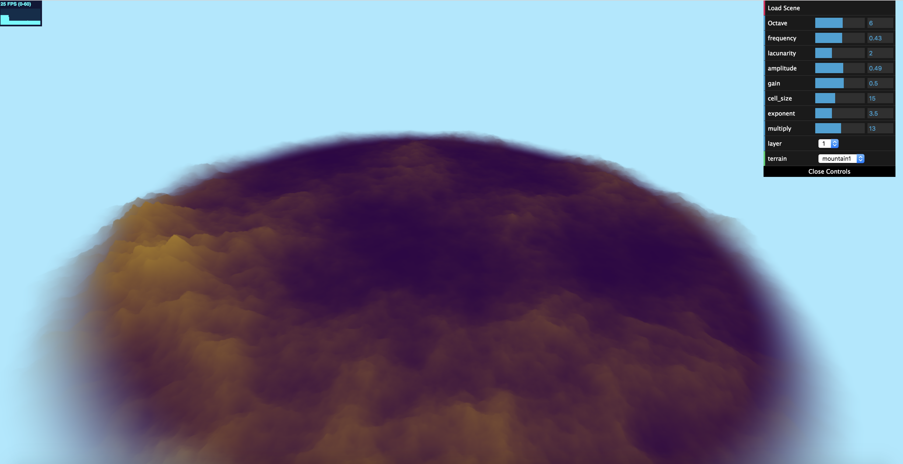
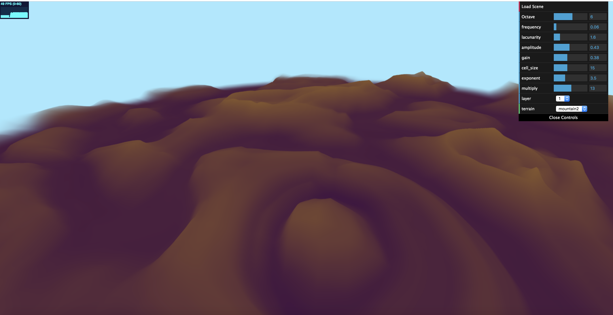
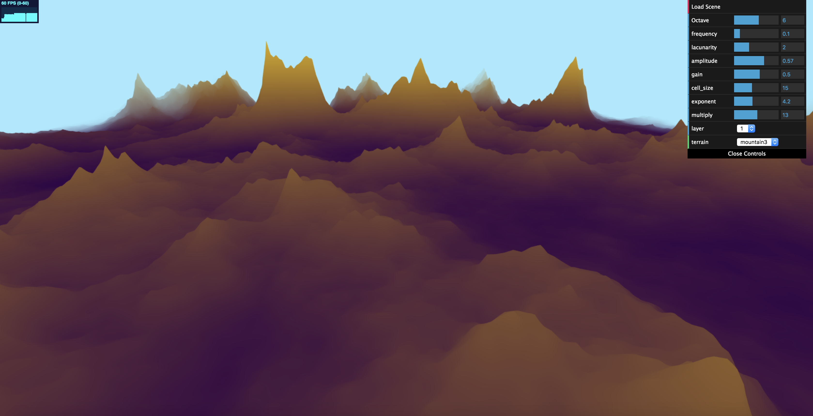

# CIS 566 Homework 1: Noisy Terrain

- Author: Dian Chen 
- Pennkey: dianchen

## Showcases
### Cellular Mountain Range

Combined Worley noise with Perlin noise in the FBM to produce mountaineous surfaces, while maintianing an overall cellular structure. The linkings among major mountains forms mountain ranges.

### Circular Ridges
 

Used recursive FBM to produce wierd ridges. Adjusting the "layer of dreams" can produce even dreamy patterns.

### Sharp Peaks

Usual lattice-based noise with FBM.

## Details
### Shaders
In the vertex shaders you can find noise implementations used at several level:

- Level 1: Basic noise that returns pseudo-random values at any certain point
- Level 2: Perlin noise, Spatial noise and Worley noise that make use of noise values at lattice points and then calculate using interpolation
- Level 3: Different permutations of the Level 2 noises
- Level 4: Fractal Brownian Motion (FBM) functions that compound Level 2 or Level 3 noises, with various permutation or combination
- Level 5: Recursive FBMs that "dreams" using different Level 4 noise

The interpolation, falloff and other helper functions are implemented as well. I chose to not include every single noise functions in the 3 showcase terrains, but used the ones with better visual results. You can off course manually modify the shaders to wake up the other noise!

### GUI parameters
The parameters that control the nature of the terrains are readily accesible in the GUI, which include:

- FBM parameters (frequence, lancunarity, amplitude, gain and octaves)
- Coefficients of a polynomial function that further modifies the noise (exponent, multiply)
- Cell size for Worley noise, if using "mountain1"
- Number of layers of "dream" for recursive FBM, if using "mountain2"
- Switching among different terrains as in Showcases, by switching shaders

## External Resources

- [IQ's Blog on Noise](http://iquilezles.org/www/)
- [FBM Chapter from The Book of Shaders](https://thebookofshaders.com/13/)
- [Perlin Noise Tutorial on ScratchAPixel](https://www.scratchapixel.com/lessons/procedural-generation-virtual-worlds/perlin-noise-part-2)

## Live Demo

[Live Demo](https://dianch.github.io/hw01-noisy-terrain/)

## TODO List

- Add procedurally controlled biomes; further exploit the fragment shader
- Add sky elements (nebula, stars, etc.) on the background
- Add time to produce dynamic scenes
- Add interactive modification of the terrain using mouse and keyboard
- Come up with more creative usage of noise
- Clean up and structure the code, which looks a bit messy for now
- ...so many things to do!

